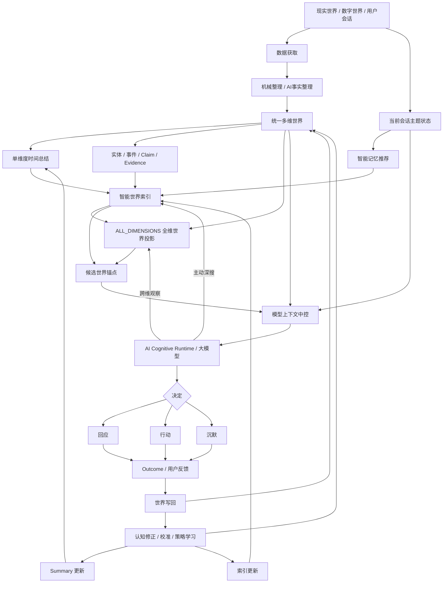

# AIOS v3.0 融合后整体运行流程图

## 一、总体原则

AIOS Core 先在软件环境中跑通完整闭环，再逐步优化、扩展数据源和接入真实硬件。

本图中的“层”仅代表运行职责，不代表多维世界内部存在父子层级。

## 二、整体流程



## 三、第一次跑通的最小闭环

第一版不追求所有能力齐全。

必须先跑通：

```text
虚拟用户会话 / 虚拟生活事件
↓
Observation / Conversation
↓
SQLiteWorldStore
↓
单维 Summary
↓
智能世界索引
↓
会话主题推荐
↓
上下文中控
↓
真实大模型
↓
回答 / 主动搜索
↓
Claim / 用户理解 / AI经验 写回
↓
下一轮会话再次检索到更新后的世界
```

只要这条链在连续多天虚拟人生中成立，AIOS 就第一次真正“活起来”。

## 四、第二阶段增加

在最小闭环稳定后增加：

- ALL_DIMENSIONS 全维投影；
- AI用户理解；
- AI关系；
- AI自我；
- 策略学习；
- 认知修正传播；
- Goal / Task / Action / Outcome；
- 多模态模拟数据；
- 长会话与跨会话连续。

## 五、第三阶段增加

最后再优化：

- 检索速度；
- 向量 / 图混合召回；
- 推荐排序；
- 索引增量维护；
- token预算；
- 延迟；
- 存储压缩；
- Android / Linux / 手机传感器真实接入。

